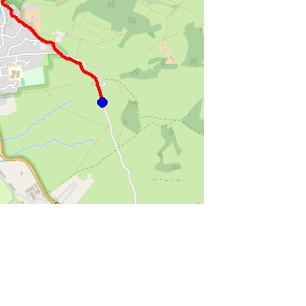
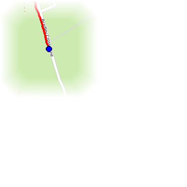

<!-- 

Auto Generated File DO NOT EDIT 

-->

# Moving Journey Map

This is a combination of the Moving Map and the Journey map. It shows the entire journey, but also moves - it doesn't currently rotate.

It renders the journey at a given zoom level, moving the map to fit the current location


```xml
<component type="moving_journey_map" size="256" />
```
<kbd></kbd>


## Sizing


```xml
<component type="moving_journey_map" size="128" />
```
<kbd></kbd>


```xml
<component type="moving_journey_map" size="384" />
```
<kbd></kbd>


## Zoom

The zoom can be set with `zoom` - Very high levels of zoom might not work reliably for long journeys, or may move too quickly on the video.


```xml
<component type="moving_journey_map" size="256" zoom="11" />
```
<kbd></kbd>


```xml
<component type="moving_journey_map" size="256" zoom="14" />
```
<kbd></kbd>


## Positioning, Transparency and Corners

The component should be placed in a `translate` to move it around the screen
To make the component rounded or transparent, it can be placed in a `frame`


```xml
<translate x="20" y="20">
    <frame width="256" height="256" outline="255,0,0" opacity="0.6" cr="128">
        <component type="moving_journey_map" name="moving_map" size="256" zoom="16"/>
    </frame>
</translate>
```
<kbd></kbd>


## Fade out

Corners can be faded out using parent frame's `fo` where you can specify how many pixels to use for the fade out.


```xml
<frame width="200" height="200" bg="255,255,255">
    <frame width="200" height="200" cr="50" fo="40">
      <component type="moving_journey_map" size="200"/>
    </frame>
</frame>
```
<kbd></kbd>

